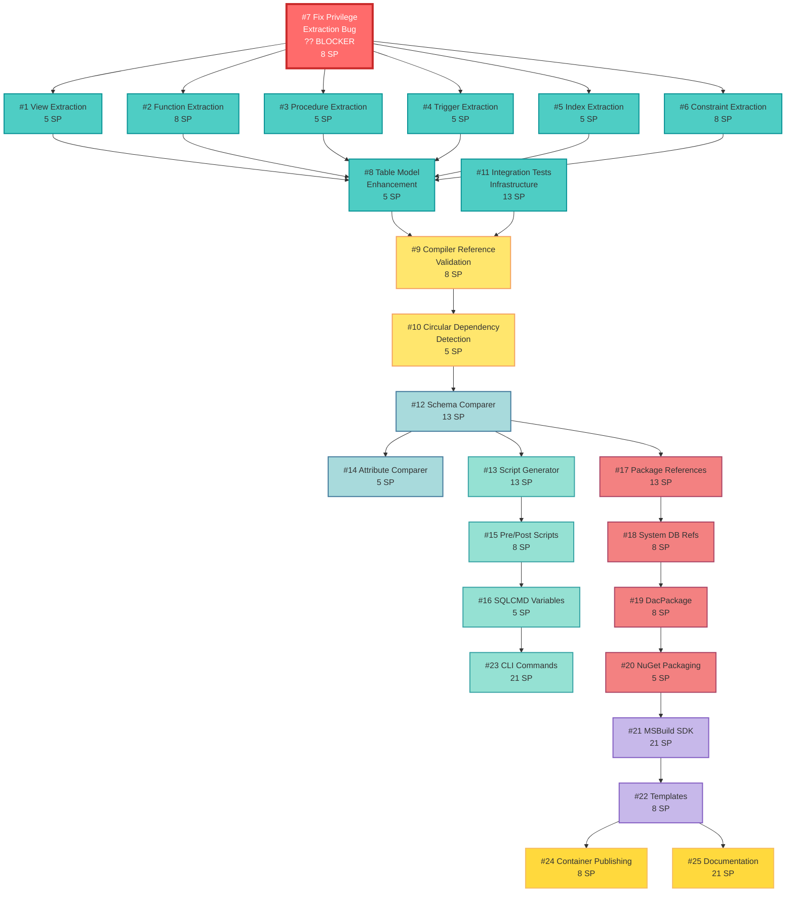
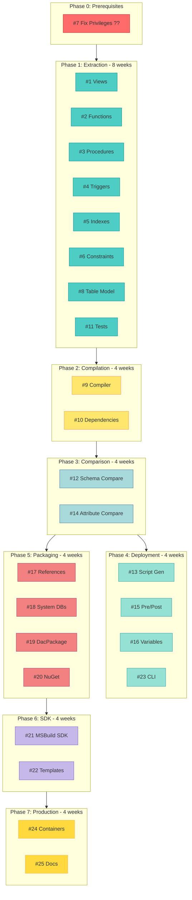
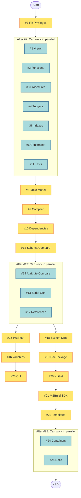
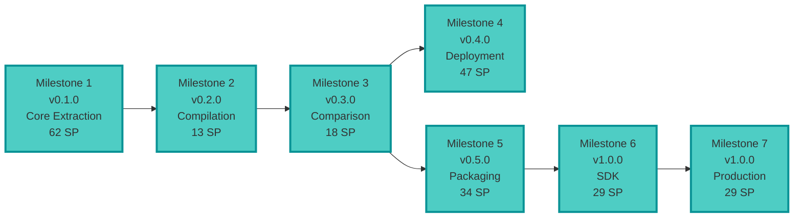
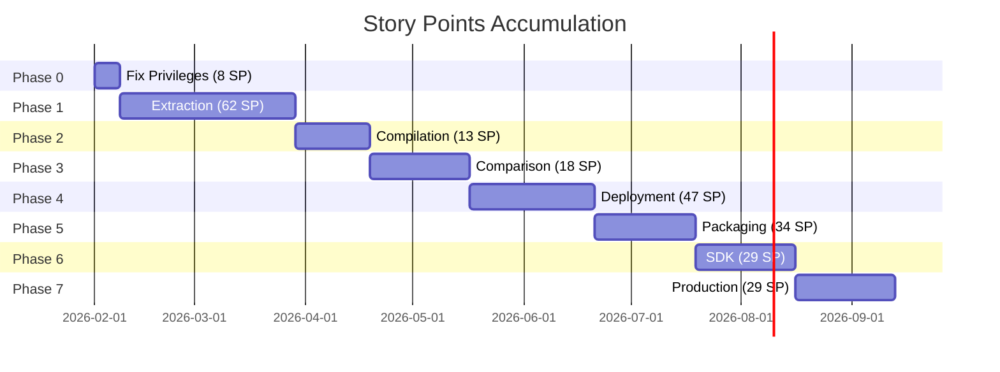

# pgPacTool - Visual Dependency Diagram

**Project:** PostgreSQL Data-Tier Application Compiler  
**Last Updated:** 2026-01-31

---

## ?? Critical Path Overview

This diagram shows the dependency relationships between all 25 issues, highlighting the critical path and parallel work opportunities.

---

## ?? Main Dependency Flow (Mermaid)



---

## ?? Critical Path (Sequential)

The longest dependency chain that determines minimum project duration:

```mermaid
graph LR
    Start([Start]) --> I7[#7 Fix Privileges<br/>8 SP]
    I7 --> I2[#2 Functions<br/>8 SP]
    I2 --> I8[#8 Table Model<br/>5 SP]
    I8 --> I9[#9 Compiler<br/>8 SP]
    I9 --> I10[#10 Dependencies<br/>5 SP]
    I10 --> I12[#12 Comparison<br/>13 SP]
    I12 --> I13[#13 Script Gen<br/>13 SP]
    I13 --> I15[#15 Pre/Post<br/>8 SP]
    I15 --> I16[#16 Variables<br/>5 SP]
    I16 --> I23[#23 CLI<br/>21 SP]
    I23 --> End([v0.4.0])
    
    classDef critical fill:#ff6b6b,stroke:#c92a2a,stroke-width:3px,color:#fff
    class I7,I2,I8,I9,I10,I12,I13,I15,I16,I23 critical
```



**Critical Path Story Points:** 94 SP  
**Estimated Duration:** ~19 weeks (assuming 5 SP/week)

---

## ?? Phase-Based Dependency Tree



---

## ? Parallel Work Opportunities

Issues that can be worked on simultaneously (no dependencies between them):



**Key Parallel Groups:**
1. **Group 1 (7 issues):** After #7, all extraction issues can be done simultaneously
2. **Group 2 (3 issues):** After #12, comparison/deployment/packaging can split
3. **Group 3 (2 issues):** After #22, final polish can be done in parallel

---

## ?? Milestone Dependencies



---

## ?? Cumulative Story Points by Phase



**Cumulative Story Points:**
- After Phase 0: 8 SP (4%)
- After Phase 1: 70 SP (33%)
- After Phase 2: 83 SP (39%)
- After Phase 3: 101 SP (47%)
- After Phase 4: 148 SP (69%)
- After Phase 5: 182 SP (85%)
- After Phase 6: 211 SP (99%)
- After Phase 7: 240 SP (100%) ?

---

## ?? Detailed Issue Dependencies Table

| Issue | Depends On | Blocks | Can Work With (Parallel) |
|-------|------------|--------|--------------------------|
| **#7** | None | #1, #2, #3, #4, #5, #6 | #11 |
| **#1** | #7 | #8 | #2, #3, #4, #5, #6, #11 |
| **#2** | #7 | #8 | #1, #3, #4, #5, #6, #11 |
| **#3** | #7 | #8 | #1, #2, #4, #5, #6, #11 |
| **#4** | #7 | #8 | #1, #2, #3, #5, #6, #11 |
| **#5** | #7 | #8 | #1, #2, #3, #4, #6, #11 |
| **#6** | #7 | #8 | #1, #2, #3, #4, #5, #11 |
| **#8** | #1-6 | #9 | None |
| **#11** | #7 | #9 | #1-6 |
| **#9** | #8, #11 | #10 | None |
| **#10** | #9 | #12 | None |
| **#12** | #10 | #13, #14, #17 | None |
| **#13** | #12 | #15 | #14, #17 |
| **#14** | #12 | None | #13, #17 |
| **#15** | #13 | #16 | #17, #18 |
| **#16** | #15 | #23 | #17, #18 |
| **#17** | #12 | #18 | #13, #14, #15, #16 |
| **#18** | #17 | #19 | #15, #16 |
| **#19** | #18 | #20 | None |
| **#20** | #19 | #21 | None |
| **#21** | #20 | #22 | None |
| **#22** | #21 | #24, #25 | None |
| **#23** | #16 | None | None |
| **#24** | #22 | None | #25 |
| **#25** | #22 | None | #24 |

---

## ?? Blocker Analysis

### Current Blockers (Red)
- **Issue #7** - Blocks 6 extraction issues
  - Impact: Cannot start any extraction work
  - Priority: Fix immediately
  - Estimated: 2-3 days

### Near-term Risks (Yellow)
- **Issue #8** - Aggregates all extraction work
  - Blocks compilation phase
  - Requires all extraction issues complete
  
- **Issue #12** - Gateway to multiple paths
  - Blocks deployment, packaging, and comparison tracks
  - Consider starting early if possible

### Optimization Opportunities (Green)
- **Group 1:** Issues #1-6, #11 (7 issues) can be distributed across 7 developers
- **Group 2:** Issues #13, #14, #17 can be worked simultaneously after #12
- **Group 3:** Issues #24, #25 can be worked simultaneously at the end

---

## ?? Resource Allocation Recommendations

### Team of 3 Developers

**Week 1:**
- Dev 1: Issue #7 (blocker)
- Dev 2: Issue #11 (test infrastructure)
- Dev 3: Planning and setup

**Weeks 2-8:**
- Dev 1: Issues #1, #4 (views, triggers)
- Dev 2: Issues #2, #5 (functions, indexes)
- Dev 3: Issues #3, #6, #8 (procedures, constraints, model)

**Weeks 9-12:**
- Dev 1: Issue #9 (compiler)
- Dev 2: Issue #10 (dependencies)
- Dev 3: Support and testing

**Weeks 13+:**
- Follow critical path with parallel work as available

### Team of 5+ Developers

**Week 1:**
- Dev 1: Issue #7 (blocker)
- Dev 2: Issue #11 (test infrastructure)
- Devs 3-5: Setup, planning, documentation

**Weeks 2-4:**
- Dev 1: Issue #1 (views)
- Dev 2: Issue #2 (functions)
- Dev 3: Issue #3 (procedures)
- Dev 4: Issue #4 (triggers)
- Dev 5: Issue #5 (indexes)

**Weeks 5-6:**
- Dev 1: Issue #6 (constraints)
- Dev 2: Issue #8 (table model)
- Devs 3-5: Testing and refinement

**Weeks 7+:**
- Split on critical path vs. packaging path

---

## ?? Color Legend

### By Priority
- ?? **Red** - Critical/Blocker (P0)
- ?? **Orange** - High Priority/MVP (P1)
- ?? **Yellow** - Medium Priority (P2)
- ?? **Green** - Low Priority (P3)

### By Phase
- ?? **Red** - Phase 0: Prerequisites (Blocker)
- ?? **Cyan** - Phase 1: Extraction
- ?? **Yellow** - Phase 2: Compilation
- ?? **Light Blue** - Phase 3: Comparison
- ?? **Green** - Phase 4: Deployment
- ?? **Pink** - Phase 5: Packaging
- ?? **Purple** - Phase 6: SDK
- ?? **Gold** - Phase 7: Production

### By Status
- ?? **Red** - Not Started
- ?? **Yellow** - In Progress
- ?? **Green** - Complete
- ?? **Gray** - Blocked

---

## ?? Using These Diagrams

### For Planning
1. **Identify Critical Path:** Focus on red issues in critical path diagram
2. **Find Parallel Work:** Use parallel opportunities diagram to assign work
3. **Check Dependencies:** Ensure upstream work is complete before starting

### For Daily Standup
1. **Show Current Work:** Point to issues in progress on main diagram
2. **Identify Blockers:** Highlight blocked issues
3. **Plan Next Work:** Show next available issues

### For Sprint Planning
1. **Select from Phase:** Choose issues within current phase
2. **Check Dependencies:** Verify all dependencies are met
3. **Assign Parallel Work:** Distribute independent issues across team

### For Reporting
1. **Show Progress:** Use cumulative story points diagram
2. **Highlight Milestones:** Point to completed milestones
3. **Forecast Completion:** Use phase timeline to estimate

---

## ?? Keeping Diagrams Updated

### When an Issue Completes
- Update status in all diagrams
- Check what issues are now unblocked
- Highlight new available work

### When Dependencies Change
- Update dependency arrows
- Recalculate critical path
- Notify team of changes

### When Adding New Issues
- Add to appropriate phase
- Connect dependencies
- Update story point totals

---

## ?? Exporting Diagrams

### To Generate Visual Images

**Using Mermaid CLI:**
```bash
# Install mermaid-cli
npm install -g @mermaid-js/mermaid-cli

# Generate PNG
mmdc -i DEPENDENCIES.md -o dependency-diagram.png

# Generate SVG
mmdc -i DEPENDENCIES.md -o dependency-diagram.svg
```

**Using Online Tools:**
- [Mermaid Live Editor](https://mermaid.live/)
- [GitHub Markdown](https://github.com) - Renders mermaid automatically

**Using VS Code:**
- Install "Markdown Preview Mermaid Support" extension
- Preview this file to see diagrams

---

## ?? Related Documents

- **[ISSUES.md](ISSUES.md)** - Detailed issue descriptions
- **[ROADMAP.md](ROADMAP.md)** - Timeline and milestones
- **[PROJECT_BOARD.md](PROJECT_BOARD.md)** - Board structure
- **[README.md](README.md)** - Quick reference

---

**Document Version:** 1.0  
**Last Updated:** 2026-01-31  
**Diagram Format:** Mermaid 10.x  
**Next Review:** After completing Milestone 1
