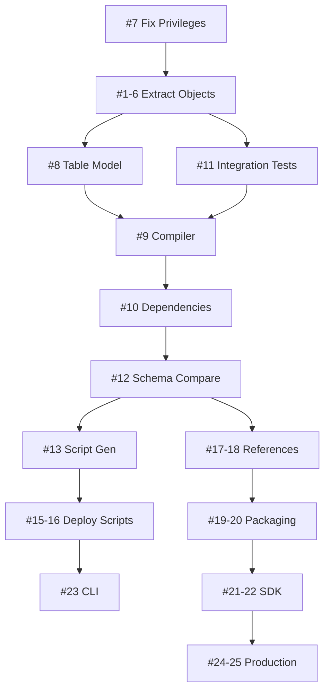

# pgPacTool - Development Roadmap

**Project:** PostgreSQL Data-Tier Application Compiler  
**Target Framework:** .NET 10  
**Project Type:** SDK-style Database Project Tool  
**Last Updated:** 2026-01-31

---

## Overview

pgPacTool provides MSBuild.Sdk.SqlProj-like functionality for PostgreSQL databases, enabling version control, compilation, comparison, and deployment of PostgreSQL database schemas using modern .NET tooling.

---

## Vision & Goals

### Primary Goal
Create a comprehensive database development tool for PostgreSQL that matches the functionality and developer experience of SQL Server Data Tools (SSDT) but designed for PostgreSQL.

### Success Criteria
- ? Extract complete database schemas from PostgreSQL 12-16
- ? Compile and validate SQL scripts with full dependency checking
- ? Compare schemas and generate deployment scripts
- ? Package databases as `.pgpac` files
- ? Deploy via CLI, MSBuild, or containers
- ? Support NuGet package references
- ? Integrate with Visual Studio via MSBuild SDK

---

## Development Phases

```
Phase 0: Prerequisites
    ?
Phase 1: Extraction (8 weeks)
    ?
Phase 2: Compilation (4 weeks)
    ?
Phase 3: Comparison (4 weeks)
    ?
Phase 4: Deployment (4 weeks)
    ?
Phase 5: Packaging (4 weeks)
    ?
Phase 6: SDK & Polish (4 weeks)
    ?
v1.0 Release
```

**Total Timeline:** 28-32 weeks (7-8 months)

---

## Milestone Roadmap

### ?? Milestone 1: Core Extraction (v0.1.0)
**Timeline:** Weeks 1-8  
**Status:** ?? Not Started

#### Goals
- Complete extraction of all PostgreSQL object types
- Fix privilege/ACL extraction
- Integration test infrastructure with Testcontainers
- Basic CLI tool (extract command)

#### Deliverables
| Issue | Feature | Story Points | Status |
|-------|---------|--------------|--------|
| #7 | Fix Privilege Extraction Bug | 8 | ?? Blocker |
| #1 | View Extraction | 5 | ?? |
| #2 | Function Extraction | 8 | ?? |
| #3 | Procedure Extraction (PG 11+) | 5 | ?? |
| #4 | Trigger Extraction | 5 | ?? |
| #5 | Index Extraction | 5 | ?? |
| #6 | Constraint Extraction | 8 | ?? |
| #8 | Enhance PgTable Model | 5 | ?? |
| #11 | Integration Tests Infrastructure | 13 | ?? |

**Total:** 62 story points

#### Success Metrics
- ? Extract Northwind database completely
- ? All object types captured with metadata
- ? Privileges extracted correctly
- ? Test coverage > 70%
- ? Tests pass on PostgreSQL 16

---

### ?? Milestone 2: Compilation & Validation (v0.2.0)
**Timeline:** Weeks 9-12  
**Status:** ?? Not Started

#### Goals
- SQL compilation with syntax validation
- Reference validation across files
- Circular dependency detection
- Clear error reporting

#### Deliverables
| Issue | Feature | Story Points | Status |
|-------|---------|--------------|--------|
| #9 | Compiler Reference Validation | 8 | ?? |
| #10 | Circular Dependency Detection | 5 | ?? |

**Total:** 13 story points

#### Success Metrics
- ? Validate all object references
- ? Detect circular dependencies
- ? Clear error messages with line numbers
- ? No false positives in validation

---

### ?? Milestone 3: Schema Comparison (v0.3.0)
**Timeline:** Weeks 13-16  
**Status:** ?? Not Started

#### Goals
- Complete schema comparison
- Column-level difference detection
- Generate comparison reports

#### Deliverables
| Issue | Feature | Story Points | Status |
|-------|---------|--------------|--------|
| #12 | Complete PgSchemaComparer | 13 | ?? |
| #14 | Attribute Comparer | 5 | ?? |

**Total:** 18 story points

#### Success Metrics
- ? Compare any two databases
- ? All object types compared
- ? Accurate diff detection
- ? Human-readable comparison reports

---

### ?? Milestone 4: Deployment & Publishing (v0.4.0)
**Timeline:** Weeks 17-20  
**Status:** ?? Not Started

#### Goals
- Generate deployment scripts from diffs
- Pre/post deployment script support
- SQLCMD variable substitution
- CLI publish command

#### Deliverables
| Issue | Feature | Story Points | Status |
|-------|---------|--------------|--------|
| #13 | PublishScriptGenerator | 13 | ?? |
| #15 | Pre/Post Deployment Scripts | 8 | ?? |
| #16 | SQLCMD Variables | 5 | ?? |
| #23 | CLI Commands (publish) | 21 | ?? |

**Total:** 47 story points

#### Success Metrics
- ? Scripts deploy successfully
- ? No data loss in safe scenarios
- ? Variables substituted correctly
- ? Rollback scripts generated

---

### ?? Milestone 5: Packaging & References (v0.5.0)
**Timeline:** Weeks 21-24  
**Status:** ?? Not Started

#### Goals
- DacPackage (.pgpac) format
- NuGet package creation
- Package/project references
- System database references

#### Deliverables
| Issue | Feature | Story Points | Status |
|-------|---------|--------------|--------|
| #19 | DacPackage Implementation | 8 | ?? |
| #20 | NuGet Packaging Support | 5 | ?? |
| #17 | Package & Project References | 13 | ?? |
| #18 | System Database References | 8 | ?? |

**Total:** 34 story points

#### Success Metrics
- ? Create and load .pgpac files
- ? Package references work
- ? NuGet packages publishable
- ? Reference resolution correct

---

### ?? Milestone 6: MSBuild SDK (v1.0.0)
**Timeline:** Weeks 25-28  
**Status:** ?? Not Started

#### Goals
- MSBuild SDK package
- Project and item templates
- Visual Studio integration
- Build system integration

#### Deliverables
| Issue | Feature | Story Points | Status |
|-------|---------|--------------|--------|
| #21 | MSBuild.Sdk.PgProj Package | 21 | ?? |
| #22 | Project & Item Templates | 8 | ?? |

**Total:** 29 story points

#### Success Metrics
- ? `dotnet new pgproj` works
- ? Projects build with MSBuild
- ? Visual Studio integration
- ? Item templates available

---

### ?? Milestone 7: Production Ready (v1.0.0)
**Timeline:** Weeks 29-32  
**Status:** ?? Not Started

#### Goals
- Container image publishing
- Comprehensive documentation
- Performance optimization
- Production hardening

#### Deliverables
| Issue | Feature | Story Points | Status |
|-------|---------|--------------|--------|
| #24 | Container Image Publishing | 8 | ?? |
| #25 | Comprehensive Documentation | 21 | ?? |

**Total:** 29 story points

#### Success Metrics
- ? All features complete
- ? Test coverage > 80%
- ? Documentation complete
- ? Performance benchmarks met
- ? Ready for production use

---

## Feature Matrix

### Current State vs Target State

| Feature | Current | v0.1.0 | v0.2.0 | v0.3.0 | v0.4.0 | v0.5.0 | v1.0.0 |
|---------|---------|--------|--------|--------|--------|--------|--------|
| **Extraction** |
| Tables | ? Partial | ? | ? | ? | ? | ? | ? |
| Views | ? | ? | ? | ? | ? | ? | ? |
| Functions | ? | ? | ? | ? | ? | ? | ? |
| Procedures | ? | ? | ? | ? | ? | ? | ? |
| Triggers | ? | ? | ? | ? | ? | ? | ? |
| Indexes | ? | ? | ? | ? | ? | ? | ? |
| Constraints | ? | ? | ? | ? | ? | ? | ? |
| Sequences | ? Partial | ? | ? | ? | ? | ? | ? |
| Types | ? Partial | ? | ? | ? | ? | ? | ? |
| Privileges | ? Bug | ? | ? | ? | ? | ? | ? |
| **Compilation** |
| Syntax Validation | ? Basic | ? | ? | ? | ? | ? | ? |
| Reference Validation | ? | ? | ? | ? | ? | ? | ? |
| Circular Dependencies | ? | ? | ? | ? | ? | ? | ? |
| Error Reporting | ? Basic | ? | ? | ? | ? | ? | ? |
| **Comparison** |
| Schema Comparison | ? Partial | ? | ? | ? | ? | ? | ? |
| Column Comparison | ? | ? | ? | ? | ? | ? | ? |
| Diff Reports | ? | ? | ? | ? | ? | ? | ? |
| **Deployment** |
| Script Generation | ? | ? | ? | ? | ? | ? | ? |
| Pre/Post Scripts | ? | ? | ? | ? | ? | ? | ? |
| SQLCMD Variables | ? | ? | ? | ? | ? | ? | ? |
| CLI Publish | ? | ? | ? | ? | ? | ? | ? |
| Container Publish | ? | ? | ? | ? | ? | ? | ? |
| **Packaging** |
| .pgpac Format | ? | ? | ? | ? | ? | ? | ? |
| NuGet Packages | ? | ? | ? | ? | ? | ? | ? |
| Package References | ? | ? | ? | ? | ? | ? | ? |
| Project References | ? | ? | ? | ? | ? | ? | ? |
| **SDK** |
| MSBuild SDK | ? | ? | ? | ? | ? | ? | ? |
| Project Templates | ? | ? | ? | ? | ? | ? | ? |
| Item Templates | ? | ? | ? | ? | ? | ? | ? |
| VS Integration | ? | ? | ? | ? | ? | ? | ? |

**Legend:**
- ? Complete
- ? Partial - Partially implemented
- ? Basic - Basic implementation
- ? - Not implemented
- ? Bug - Known bug

---

## PostgreSQL Version Support

| Version | Release Date | EOL Date | Support Status |
|---------|-------------|----------|----------------|
| PostgreSQL 16 | Sep 2023 | Nov 2028 | ? Target |
| PostgreSQL 15 | Oct 2022 | Nov 2027 | ? Target |
| PostgreSQL 14 | Sep 2021 | Nov 2026 | ? Target |
| PostgreSQL 13 | Sep 2020 | Nov 2025 | ? Target |
| PostgreSQL 12 | Oct 2019 | Nov 2024 | ? Target |
| PostgreSQL 11 | Oct 2018 | Nov 2023 | ?? Limited (procedures only) |
| PostgreSQL 10 | Oct 2017 | Nov 2022 | ? Not supported |

**Notes:**
- Full support for PostgreSQL 12-16
- Limited support for PG 11 (procedures require version check)
- Focus on LTS versions still in support

---

## Technology Stack

### Core Technologies
- **.NET 10** - Target framework
- **C#** - Primary language
- **Npgsql 9.0+** - PostgreSQL .NET driver
- **mbulava-org.Npgquery** - PostgreSQL SQL parser and AST

### Testing
- **NUnit** - Test framework
- **Testcontainers** - Integration test infrastructure
- **PostgreSQL Docker Images** - Multi-version testing

### Build & Distribution
- **MSBuild SDK** - Project system
- **NuGet** - Package distribution
- **Docker** - Container publishing

### CI/CD
- **GitHub Actions** - Automation (assumed)
- **Test coverage tools** - Quality metrics

---

## Dependencies & Blockers

### Critical Path



### Key Blockers
1. **Issue #7 (Privilege Extraction)** - Blocks all extraction work
2. **Issue #11 (Test Infrastructure)** - Needed for validating extraction
3. **Issue #12 (Schema Comparison)** - Blocks deployment features

---

## Risk Assessment

### High Risk Items

| Risk | Impact | Probability | Mitigation |
|------|--------|-------------|------------|
| Npgquery parser limitations | High | Medium | Fallback to string parsing for unsupported syntax |
| PostgreSQL version incompatibilities | Medium | Low | Multi-version testing with Testcontainers |
| Test infrastructure setup issues | High | Medium | Fix #11 early, invest in stable test base |
| Scope creep | High | Medium | Stick to roadmap, defer non-MVP features |
| Performance with large databases | Medium | Low | Performance benchmarks, optimize in v1.0 |

### Medium Risk Items

| Risk | Impact | Probability | Mitigation |
|------|--------|-------------|------------|
| ACL parsing complexity | Medium | High | Thorough testing with various ACL formats |
| Circular dependency false positives | Low | Medium | Careful algorithm implementation |
| Container image size | Low | Low | Multi-stage builds, minimal base images |
| Documentation completeness | Medium | Medium | Document as we build, allocate time |

---

## Success Metrics

### Quantitative Metrics

**Code Quality:**
- Test coverage > 80%
- Zero critical bugs in production
- Code review completion rate: 100%

**Performance:**
- Extract 100-table database < 10 seconds
- Compile 1000-file project < 30 seconds
- Generate deployment script < 5 seconds

**Adoption:**
- 100+ GitHub stars by v1.0
- 50+ NuGet downloads by v1.0
- 5+ external contributors

### Qualitative Metrics

**User Experience:**
- Clear error messages with actionable guidance
- Consistent CLI experience
- Good documentation coverage

**Developer Experience:**
- Easy to get started (< 5 minutes)
- Intuitive API design
- Good IDE integration

---

## Post-v1.0 Roadmap (Future)

### v1.1.0 - Advanced Features
- Static code analysis rules
- Performance hints
- Security scanning
- Data comparison & sync

### v1.2.0 - Visual Studio Extension
- Project templates in VS
- Object templates in VS
- IntelliSense support
- Deployment dialog
- Schema comparison UI

### v2.0.0 - Enterprise Features
- Multi-database deployments
- Deployment orchestration
- Advanced refactoring support
- Custom rule authoring
- CI/CD templates (GitHub Actions, Azure DevOps)

---

## Community & Contribution

### How to Contribute

1. **Check the Issues:** See `ISSUES.md` for detailed task list
2. **Pick an Issue:** Look for `good first issue` label
3. **Follow Guidelines:** See `CONTRIBUTING.md`
4. **Submit PR:** Link to issue, follow PR template

### Communication

- **GitHub Issues:** Bug reports, feature requests
- **GitHub Discussions:** Q&A, general discussion
- **Pull Requests:** Code contributions

---

## Resources

### Documentation
- `ISSUES.md` - Detailed issue tracker
- `PROJECT_BOARD.md` - Project board structure
- `README.md` - Project overview
- `CONTRIBUTING.md` - Contribution guidelines

### External References
- [MSBuild.Sdk.SqlProj](https://github.com/rr-wfm/MSBuild.Sdk.SqlProj) - Inspiration
- [PostgreSQL Documentation](https://www.postgresql.org/docs/)
- [Npgsql Documentation](https://www.npgsql.org/)
- [SSDT Documentation](https://learn.microsoft.com/sql/ssdt/)

---

## Changelog

### 2026-01-31 - Initial Roadmap
- Created comprehensive roadmap
- Defined 7 milestones
- Identified 25 issues
- Estimated 28-32 week timeline

---

**Document Version:** 1.0  
**Last Updated:** 2026-01-31  
**Next Review:** After Milestone 1 completion
