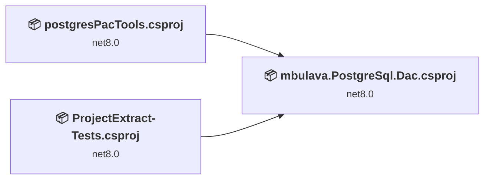
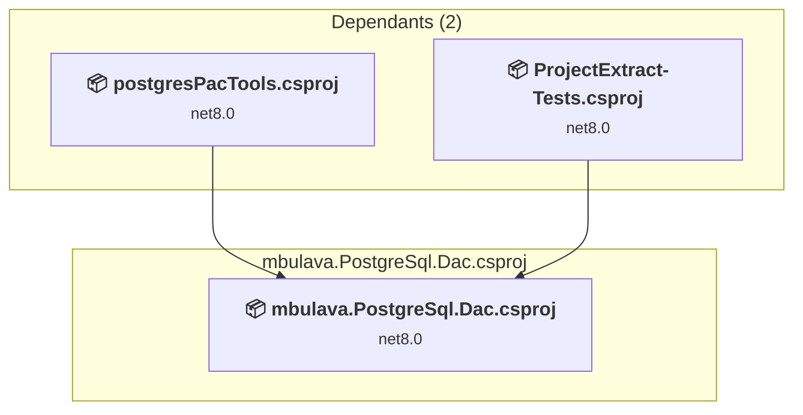
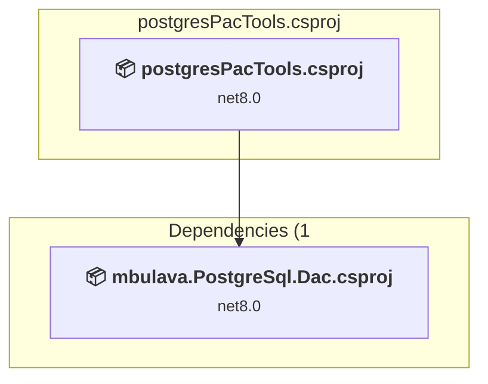
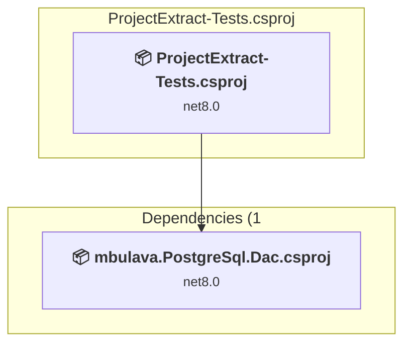

# Projects and dependencies analysis

This document provides a comprehensive overview of the projects and their dependencies in the context of upgrading to .NETCoreApp,Version=v10.0.

## Table of Contents

- [Executive Summary](#executive-Summary)
  - [Highlevel Metrics](#highlevel-metrics)
  - [Projects Compatibility](#projects-compatibility)
  - [Package Compatibility](#package-compatibility)
  - [API Compatibility](#api-compatibility)
- [Aggregate NuGet packages details](#aggregate-nuget-packages-details)
- [Top API Migration Challenges](#top-api-migration-challenges)
  - [Technologies and Features](#technologies-and-features)
  - [Most Frequent API Issues](#most-frequent-api-issues)
- [Projects Relationship Graph](#projects-relationship-graph)
- [Project Details](#project-details)

  - [src\libs\mbulava.PostgreSql.Dac\mbulava.PostgreSql.Dac.csproj](#srclibsmbulavapostgresqldacmbulavapostgresqldaccsproj)
  - [src\postgresPacTools\postgresPacTools.csproj](#srcpostgrespactoolspostgrespactoolscsproj)
  - [tests\ProjectExtract-Tests\ProjectExtract-Tests.csproj](#testsprojectextract-testsprojectextract-testscsproj)

## Executive Summary

### Highlevel Metrics

| Metric | Count | Status |
| :--- | :---: | :--- |
| Total Projects | 3 | All require upgrade |
| Total NuGet Packages | 9 | All compatible |
| Total Code Files | 15 |  |
| Total Code Files with Incidents | 5 |  |
| Total Lines of Code | 2019 |  |
| Total Number of Issues | 15 |  |
| Estimated LOC to modify | 12+ | at least 0.6% of codebase |

### Projects Compatibility

| Project | Target Framework | Difficulty | Package Issues | API Issues | Est. LOC Impact | Description |
| :--- | :---: | :---: | :---: | :---: | :---: | :--- |
| [src\libs\mbulava.PostgreSql.Dac\mbulava.PostgreSql.Dac.csproj](#srclibsmbulavapostgresqldacmbulavapostgresqldaccsproj) | net8.0 | 🟢 Low | 0 | 12 | 12+ | ClassLibrary, Sdk Style = True |
| [src\postgresPacTools\postgresPacTools.csproj](#srcpostgrespactoolspostgrespactoolscsproj) | net8.0 | 🟢 Low | 0 | 0 |  | DotNetCoreApp, Sdk Style = True |
| [tests\ProjectExtract-Tests\ProjectExtract-Tests.csproj](#testsprojectextract-testsprojectextract-testscsproj) | net8.0 | 🟢 Low | 0 | 0 |  | DotNetCoreApp, Sdk Style = True |

### Package Compatibility

| Status | Count | Percentage |
| :--- | :---: | :---: |
| ✅ Compatible | 9 | 100.0% |
| ⚠️ Incompatible | 0 | 0.0% |
| 🔄 Upgrade Recommended | 0 | 0.0% |
| ***Total NuGet Packages*** | ***9*** | ***100%*** |

### API Compatibility

| Category | Count | Impact |
| :--- | :---: | :--- |
| 🔴 Binary Incompatible | 0 | High - Require code changes |
| 🟡 Source Incompatible | 0 | Medium - Needs re-compilation and potential conflicting API error fixing |
| 🔵 Behavioral change | 12 | Low - Behavioral changes that may require testing at runtime |
| ✅ Compatible | 2326 |  |
| ***Total APIs Analyzed*** | ***2338*** |  |

## Aggregate NuGet packages details

| Package | Current Version | Suggested Version | Projects | Description |
| :--- | :---: | :---: | :--- | :--- |
| coverlet.collector | 6.0.0 |  | [ProjectExtract-Tests.csproj](#testsprojectextract-testsprojectextract-testscsproj) | ✅Compatible |
| mbulava-org.Npgquery | 1.0.0.40-beta |  | [mbulava.PostgreSql.Dac.csproj](#srclibsmbulavapostgresqldacmbulavapostgresqldaccsproj) | ✅Compatible |
| Microsoft.NET.Test.Sdk | 17.8.0 |  | [ProjectExtract-Tests.csproj](#testsprojectextract-testsprojectextract-testscsproj) | ✅Compatible |
| Npgsql | 9.0.4 |  | [mbulava.PostgreSql.Dac.csproj](#srclibsmbulavapostgresqldacmbulavapostgresqldaccsproj) | ✅Compatible |
| NUnit | 3.14.0 |  | [ProjectExtract-Tests.csproj](#testsprojectextract-testsprojectextract-testscsproj) | ✅Compatible |
| NUnit.Analyzers | 3.9.0 |  | [ProjectExtract-Tests.csproj](#testsprojectextract-testsprojectextract-testscsproj) | ✅Compatible |
| NUnit3TestAdapter | 4.5.0 |  | [ProjectExtract-Tests.csproj](#testsprojectextract-testsprojectextract-testscsproj) | ✅Compatible |
| System.CommandLine | 2.0.0-beta5.25306.1 |  | [postgresPacTools.csproj](#srcpostgrespactoolspostgrespactoolscsproj) | ✅Compatible |
| Testcontainers.PostgreSql | 3.5.0 |  | [ProjectExtract-Tests.csproj](#testsprojectextract-testsprojectextract-testscsproj) | ✅Compatible |

## Top API Migration Challenges

### Technologies and Features

| Technology | Issues | Percentage | Migration Path |
| :--- | :---: | :---: | :--- |

### Most Frequent API Issues

| API | Count | Percentage | Category |
| :--- | :---: | :---: | :--- |
| T:System.Text.Json.JsonDocument | 12 | 100.0% | Behavioral Change |

## Projects Relationship Graph

Legend:
📦 SDK-style project
⚙️ Classic project

## Project Details

### src\libs\mbulava.PostgreSql.Dac\mbulava.PostgreSql.Dac.csproj

#### Project Info

- **Current Target Framework:** net8.0
- **Proposed Target Framework:** net10.0
- **SDK-style**: True
- **Project Kind:** ClassLibrary
- **Dependencies**: 0
- **Dependants**: 2
- **Number of Files**: 12
- **Number of Files with Incidents**: 3
- **Lines of Code**: 1887
- **Estimated LOC to modify**: 12+ (at least 0.6% of the project)

#### Dependency Graph

Legend:
📦 SDK-style project
⚙️ Classic project

### API Compatibility

| Category | Count | Impact |
| :--- | :---: | :--- |
| 🔴 Binary Incompatible | 0 | High - Require code changes |
| 🟡 Source Incompatible | 0 | Medium - Needs re-compilation and potential conflicting API error fixing |
| 🔵 Behavioral change | 12 | Low - Behavioral changes that may require testing at runtime |
| ✅ Compatible | 2230 |  |
| ***Total APIs Analyzed*** | ***2242*** |  |

### src\postgresPacTools\postgresPacTools.csproj

#### Project Info

- **Current Target Framework:** net8.0
- **Proposed Target Framework:** net10.0
- **SDK-style**: True
- **Project Kind:** DotNetCoreApp
- **Dependencies**: 1
- **Dependants**: 0
- **Number of Files**: 1
- **Number of Files with Incidents**: 1
- **Lines of Code**: 15
- **Estimated LOC to modify**: 0+ (at least 0.0% of the project)

#### Dependency Graph

Legend:
📦 SDK-style project
⚙️ Classic project

### API Compatibility

| Category | Count | Impact |
| :--- | :---: | :--- |
| 🔴 Binary Incompatible | 0 | High - Require code changes |
| 🟡 Source Incompatible | 0 | Medium - Needs re-compilation and potential conflicting API error fixing |
| 🔵 Behavioral change | 0 | Low - Behavioral changes that may require testing at runtime |
| ✅ Compatible | 4 |  |
| ***Total APIs Analyzed*** | ***4*** |  |

### tests\ProjectExtract-Tests\ProjectExtract-Tests.csproj

#### Project Info

- **Current Target Framework:** net8.0
- **Proposed Target Framework:** net10.0
- **SDK-style**: True
- **Project Kind:** DotNetCoreApp
- **Dependencies**: 1
- **Dependants**: 0
- **Number of Files**: 4
- **Number of Files with Incidents**: 1
- **Lines of Code**: 117
- **Estimated LOC to modify**: 0+ (at least 0.0% of the project)

#### Dependency Graph

Legend:
📦 SDK-style project
⚙️ Classic project

### API Compatibility

| Category | Count | Impact |
| :--- | :---: | :--- |
| 🔴 Binary Incompatible | 0 | High - Require code changes |
| 🟡 Source Incompatible | 0 | Medium - Needs re-compilation and potential conflicting API error fixing |
| 🔵 Behavioral change | 0 | Low - Behavioral changes that may require testing at runtime |
| ✅ Compatible | 92 |  |
| ***Total APIs Analyzed*** | ***92*** |  |

