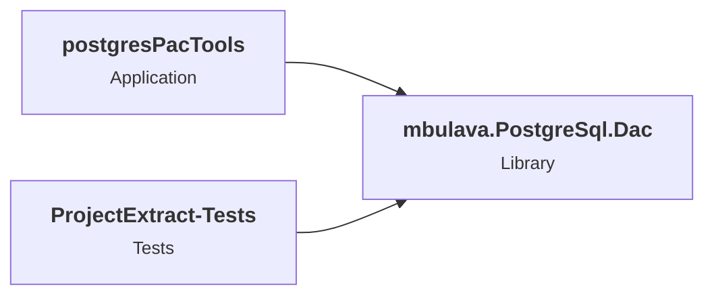

# .NET 10.0 Upgrade Plan

## Table of Contents

- [Executive Summary](#executive-summary)
- [Migration Strategy](#migration-strategy)
- [Detailed Dependency Analysis](#detailed-dependency-analysis)
- [Project-by-Project Plans](#project-by-project-plans)
  - [mbulava.PostgreSql.Dac](#mbulavapostgresqldac)
  - [postgresPacTools](#postgrespactools)
  - [ProjectExtract-Tests](#projectextract-tests)
- [Risk Management](#risk-management)
- [Testing & Validation Strategy](#testing--validation-strategy)
- [Complexity & Effort Assessment](#complexity--effort-assessment)
- [Source Control Strategy](#source-control-strategy)
- [Success Criteria](#success-criteria)

---

## Executive Summary

### Scenario Description

This plan outlines the upgrade of a PostgreSQL DAC (Data Access Component) solution from **.NET 8.0** to **.NET 10.0 (Long Term Support)**. The solution consists of a core library, a command-line tool, and associated tests.

### Scope

**Projects Affected:** 3 projects
- `mbulava.PostgreSql.Dac` - Core PostgreSQL DAC library
- `postgresPacTools` - Command-line tool for PostgreSQL package operations
- `ProjectExtract-Tests` - Unit tests for the library

**Current State:** All projects targeting net8.0  
**Target State:** All projects targeting net10.0

### Selected Strategy

**All-At-Once Strategy** - All projects will be upgraded simultaneously in a single coordinated operation.

**Rationale:**
- **Small Solution:** Only 3 projects with simple dependency structure
- **Homogeneous Codebase:** All projects currently on .NET 8.0
- **Low Complexity:** Total of 2,019 LOC with minimal expected changes
- **Package Compatibility:** All 9 NuGet packages are already compatible with .NET 10.0 (no updates required)
- **Clear Dependencies:** Single-level dependency graph (library ? dependents)
- **Low Risk:** No security vulnerabilities, no breaking API changes, only 12 behavioral changes

### Discovered Metrics

| Metric | Value | Status |
|--------|-------|--------|
| Total Projects | 3 | All require upgrade |
| Dependency Depth | 1 | Simple hierarchy |
| Total LOC | 2,019 | Small codebase |
| Estimated LOC Impact | 12+ | 0.6% of codebase |
| Security Vulnerabilities | 0 | ? None |
| Package Updates Required | 0 | ? All compatible |
| Binary Breaking Changes | 0 | ? None |
| Source Breaking Changes | 0 | ? None |
| Behavioral Changes | 12 | ?? Minimal impact |

### Complexity Classification

**Classification: Simple**

This solution meets all criteria for a straightforward, low-risk upgrade:
- Small project count (3 projects)
- Shallow dependency tree (single level)
- No high-risk factors (vulnerabilities, breaking changes, large codebase)
- All packages already compatible
- Minimal code impact expected

### Critical Issues

**No Critical Issues Identified** ?

- No security vulnerabilities in NuGet packages
- No blocking compatibility issues
- No binary or source-level breaking changes
- All dependencies compatible with target framework

### Recommended Approach

**All-At-Once Migration** - Update all three projects simultaneously in a single atomic operation. This approach is ideal given the small solution size, simple dependency structure, and low risk profile.

### Iteration Strategy

This plan uses a **fast batch approach** with 2-3 detail iterations, appropriate for simple solutions where all projects can be comprehensively specified together.

---

## Migration Strategy

### Approach Selection

**Selected Strategy: All-At-Once**

This solution is an ideal candidate for the All-At-Once migration strategy based on the following factors:

| Criterion | Assessment | All-At-Once Suitability |
|-----------|------------|------------------------|
| **Solution Size** | 3 projects | ? Excellent (< 5 projects) |
| **Current Framework** | All on .NET 8.0 | ? Excellent (homogeneous) |
| **Dependency Complexity** | Single level, no cycles | ? Excellent (simple) |
| **Codebase Size** | 2,019 LOC | ? Excellent (< 10k LOC) |
| **Package Updates** | 0 required | ? Excellent (all compatible) |
| **Breaking Changes** | 0 binary/source breaks | ? Excellent (none) |
| **Test Coverage** | Test project present | ? Good (validation available) |
| **Risk Level** | Low | ? Excellent (no vulnerabilities) |

### All-At-Once Strategy Rationale

**Why This Strategy:**

1. **Speed & Efficiency:**
   - Single operation completes upgrade across entire solution
   - No multi-targeting complexity
   - Minimal coordination overhead
   - Fastest path to .NET 10.0 benefits

2. **Low Risk Profile:**
   - All packages already compatible (zero package update risk)
   - No breaking API changes (zero code change risk)
   - Small codebase (easy to validate)
   - Only behavioral changes in JSON serialization (testable)

3. **Clean Dependency Resolution:**
   - All projects on same framework version immediately
   - No temporary version mismatches
   - Single build/test cycle
   - Clear success/failure state

4. **Team Efficiency:**
   - Single PR for entire upgrade
   - One code review process
   - Atomic commit history
   - All developers transition simultaneously

**Why Not Incremental:**
- Unnecessary overhead for 3 projects
- Would create artificial intermediate states
- No risk reduction benefit (already low risk)
- Longer total timeline without added value

### Dependency-Based Ordering Rationale

While all projects update simultaneously, the **logical validation order** respects dependencies:

1. **Foundation First:** `mbulava.PostgreSql.Dac`
   - Contains the only code with behavioral changes (JsonDocument usage)
   - Core library must be validated before consumers
   - No dependencies means no upstream risk

2. **Consumers Second:** `postgresPacTools` & `ProjectExtract-Tests`
   - Depend on validated core library
   - Minimal code impact (15 LOC + 117 LOC)
   - Test project validates entire upgrade

This logical order guides testing strategy even though all updates are performed atomically.

### Parallel vs Sequential Execution

**Atomic Execution Model:**

All file updates (project files, code changes) happen in a single coordinated batch:

```
???????????????????????????????????????????????????
?         ATOMIC UPGRADE OPERATION                ?
?                                                 ?
?  ????????????????????????????????????????      ?
?  ? 1. Update all project TargetFramework?      ?
?  ?    - mbulava.PostgreSql.Dac          ?      ?
?  ?    - postgresPacTools                ?      ?
?  ?    - ProjectExtract-Tests            ?      ?
?  ????????????????????????????????????????      ?
?                                                 ?
?  ????????????????????????????????????????      ?
?  ? 2. No package updates needed         ?      ?
?  ?    (all packages compatible)         ?      ?
?  ????????????????????????????????????????      ?
?                                                 ?
?  ????????????????????????????????????????      ?
?  ? 3. Restore & Build Solution          ?      ?
?  ????????????????????????????????????????      ?
?                                                 ?
?  ????????????????????????????????????????      ?
?  ? 4. Fix any compilation errors        ?      ?
?  ?    (if any arise)                    ?      ?
?  ????????????????????????????????????????      ?
?                                                 ?
?  ????????????????????????????????????????      ?
?  ? 5. Rebuild & Verify                  ?      ?
?  ????????????????????????????????????????      ?
?                                                 ?
???????????????????????????????????????????????????
              ?
???????????????????????????????????????????????????
?         TESTING PHASE                           ?
?                                                 ?
?  ????????????????????????????????????????      ?
?  ? 1. Execute ProjectExtract-Tests      ?      ?
?  ? 2. Validate behavioral changes       ?      ?
?  ? 3. Verify solution functionality     ?      ?
?  ????????????????????????????????????????      ?
???????????????????????????????????????????????????
```

**No Parallel Work:**
- All updates are part of single operation
- No intermediate states
- Solution either fully upgraded or not at all
- Clear rollback point (before upgrade commit)

### Phase Definitions

**Phase 0: Preparation** (Prerequisites)
- ? .NET 10.0 SDK installed
- ? Working branch created (`upgrade-to-NET10`)
- ? Clean working directory

**Phase 1: Atomic Upgrade** (Core Migration)
**Operations** (single coordinated batch):
1. Update TargetFramework in all 3 project files
2. Restore dependencies
3. Build solution
4. Fix any compilation errors
5. Verify solution builds with 0 errors

**Deliverables:**
- All projects target net10.0
- Solution builds successfully
- No errors or warnings

**Phase 2: Test Validation** (Quality Assurance)
**Operations:**
1. Execute test project (`ProjectExtract-Tests`)
2. Validate JsonDocument behavioral changes
3. Address any test failures

**Deliverables:**
- All tests pass
- Behavioral changes validated
- Solution fully functional

**Phase 3: Finalization** (Completion)
**Operations:**
1. Final smoke test
2. Documentation updates (if needed)
3. Commit changes
4. Create pull request

**Deliverables:**
- Complete upgrade committed
- Ready for code review
- PR created with upgrade details

---

## Detailed Dependency Analysis

### Dependency Graph Summary

The solution has a clean, single-level dependency structure:

```
???????????????????????????????????????
?  postgresPacTools (Application)     ?
?  ProjectExtract-Tests (Test)        ?
???????????????????????????????????????
               ?
               ?? depends on
               ?
               ?
????????????????????????????????????????
?  mbulava.PostgreSql.Dac (Library)    ?
?  (No dependencies)                   ?
????????????????????????????????????????
```

**Mermaid Diagram:**


### Project Groupings by Migration Phase

Since we're using the **All-At-Once Strategy**, all projects will be updated in a single coordinated operation. However, for logical organization and understanding, projects are grouped as follows:

**Phase 1: Atomic Upgrade (All Projects Simultaneously)**

| Group | Projects | Rationale |
|-------|----------|-----------|
| **Foundation** | `mbulava.PostgreSql.Dac` | Core library with no project dependencies (leaf node) |
| **Consumers** | `postgresPacTools`, `ProjectExtract-Tests` | Both depend on the core library |

**Note:** In All-At-Once strategy, these groupings are for conceptual understanding only. All project file updates and package updates will be performed as a single atomic operation.

### Critical Path Identification

**Critical Path:** mbulava.PostgreSql.Dac ? Consumers (postgresPacTools, ProjectExtract-Tests)

**Critical Dependencies:**
1. **mbulava.PostgreSql.Dac** is the foundational library
   - Contains the only API usage requiring attention (System.Text.Json.JsonDocument)
   - Must be validated first in testing
   - Changes here impact both dependents

2. **No External Blockers:**
   - All NuGet packages already compatible
   - No transitive dependency conflicts
   - No circular dependencies

### Circular Dependencies

**None identified** ?

The dependency graph is a clean directed acyclic graph (DAG) with no cycles.

### Dependency Constraints

1. **Build Order:** When building from clean state, the order is:
   - First: `mbulava.PostgreSql.Dac` (no dependencies)
   - Then: `postgresPacTools` and `ProjectExtract-Tests` (in parallel)

2. **Testing Order:** Execute tests after all projects are upgraded:
   - `ProjectExtract-Tests` validates the core library functionality

3. **No Version Conflicts:** All projects will target net10.0 uniformly, eliminating multi-targeting complexity

---

## Project-by-Project Plans

### mbulava.PostgreSql.Dac

**Project Path:** `src\libs\mbulava.PostgreSql.Dac\mbulava.PostgreSql.Dac.csproj`  
**Project Type:** ClassLibrary (SDK-style)  
**Dependencies:** 0 project dependencies  
**Dependants:** 2 (postgresPacTools, ProjectExtract-Tests)

**Current State:**
- **Target Framework:** net8.0
- **LOC:** 1,887
- **Files:** 12 (3 with incidents)
- **NuGet Packages:** 2
  - `mbulava-org.Npgquery` 1.0.0.40-beta (? Compatible)
  - `Npgsql` 9.0.4 (? Compatible)
- **API Issues:** 12 behavioral changes in System.Text.Json.JsonDocument

**Target State:**
- **Target Framework:** net10.0
- **Package Updates:** None required (all compatible)
- **Estimated LOC Impact:** 12+ lines (0.6% of project)

#### Migration Steps

##### 1. Prerequisites
- ? .NET 10.0 SDK installed
- ? Project uses SDK-style format (no conversion needed)
- ? All package versions compatible with .NET 10.0
- ? No project dependencies to migrate first

##### 2. Framework Update

**File:** `src\libs\mbulava.PostgreSql.Dac\mbulava.PostgreSql.Dac.csproj`

**Change Required:**
```xml
<!-- BEFORE -->
<TargetFramework>net8.0</TargetFramework>

<!-- AFTER -->
<TargetFramework>net10.0</TargetFramework>
```

**Action:** Update the `TargetFramework` property from `net8.0` to `net10.0`

##### 3. Package Updates

**No package updates required.** ?

All packages are already compatible with .NET 10.0:

| Package | Current Version | Target Version | Status |
|---------|----------------|----------------|--------|
| `mbulava-org.Npgquery` | 1.0.0.40-beta | 1.0.0.40-beta | ? Compatible as-is |
| `Npgsql` | 9.0.4 | 9.0.4 | ? Compatible as-is |

##### 4. Expected Breaking Changes

**No Breaking Changes** ?

The assessment confirms:
- **0 Binary Incompatible APIs** - No API removals or signature changes
- **0 Source Incompatible APIs** - No compilation errors expected

##### 5. Behavioral Changes

**System.Text.Json.JsonDocument** - 12 occurrences requiring validation

**Affected Areas:**
- 3 source files use JsonDocument APIs
- Estimated 12+ lines of code with JsonDocument usage

**Specific Behavioral Changes:**

While the exact changes depend on .NET 10.0's System.Text.Json improvements, common behavioral differences include:

1. **Parsing Strictness:**
   - More strict validation of malformed JSON
   - Different handling of trailing commas
   - Enhanced UTF-8 validation

2. **Memory Management:**
   - Improved pooling strategies
   - Different buffer allocation patterns
   - Optimized dispose behavior

3. **API Behavior:**
   - Enumeration order consistency improvements
   - Exception message changes
   - Default options refinements

**Impact Assessment:**
- **Compilation:** ? No impact (compatible API)
- **Runtime:** ?? Possible differences in edge cases
- **Tests:** ?? May reveal behavioral differences

**Validation Strategy:**
- Rely on existing test suite to catch behavioral differences
- Review test failures if any occur
- Compare JSON parsing results before/after upgrade if needed

##### 6. Code Modifications

**Expected:** Minimal to none

**Potential Adjustments (if tests reveal issues):**

1. **JsonDocument Usage Review:**
   - Examine files with JsonDocument usage
   - Verify parsing behavior matches expectations
   - Adjust JsonDocumentOptions if needed

2. **Error Handling:**
   - Verify exception handling for malformed JSON
   - Ensure error messages still match expectations
   - Update test assertions if error messages changed

3. **Serialization Options:**
   - Review any custom JsonSerializerOptions
   - Verify property naming policies still work
   - Check default behavior assumptions

**Files to Monitor:**
- The 3 files identified with JsonDocument incidents
- Any files with JSON parsing/serialization logic

##### 7. Testing Strategy

**Unit Tests:**
- ? `ProjectExtract-Tests` project validates this library
- Execute all tests after framework upgrade
- Focus on tests exercising JSON functionality

**Specific Validation:**
1. **JSON Parsing Tests:**
   - Verify valid JSON parsing works correctly
   - Check error handling for invalid JSON
   - Validate edge cases (empty objects, null values, nested structures)

2. **Integration Tests:**
   - Validate with real PostgreSQL query parsing scenarios
   - Test Npgsql integration still works
   - Verify query extraction functionality

3. **Behavioral Validation:**
   - Compare JSON parsing output before/after upgrade
   - Verify no unexpected serialization changes
   - Check performance characteristics if critical

**Test Execution:**
```bash
dotnet test tests\ProjectExtract-Tests\ProjectExtract-Tests.csproj
```

**Success Criteria:**
- ? All existing tests pass
- ? No new runtime errors
- ? JsonDocument behavior validated
- ? No performance regressions

##### 8. Validation Checklist

- [ ] Project file updated to net10.0
- [ ] Solution restores without errors (`dotnet restore`)
- [ ] Project builds without errors (`dotnet build`)
- [ ] Project builds without warnings
- [ ] All NuGet packages restore correctly
- [ ] No dependency conflicts reported
- [ ] All tests in ProjectExtract-Tests pass
- [ ] JsonDocument behavioral changes validated
- [ ] No runtime exceptions introduced
- [ ] Performance remains acceptable

---

### postgresPacTools

**Project Path:** `src\postgresPacTools\postgresPacTools.csproj`  
**Project Type:** DotNetCoreApp (SDK-style)  
**Dependencies:** 1 (mbulava.PostgreSql.Dac)  
**Dependants:** 0

**Current State:**
- **Target Framework:** net8.0
- **LOC:** 15
- **Files:** 1
- **NuGet Packages:** 1
  - `System.CommandLine` 2.0.0-beta5.25306.1 (? Compatible)
- **API Issues:** 0

**Target State:**
- **Target Framework:** net10.0
- **Package Updates:** None required
- **Estimated LOC Impact:** 0 (no code changes expected)

#### Migration Steps

##### 1. Prerequisites
- ? .NET 10.0 SDK installed
- ? Dependency `mbulava.PostgreSql.Dac` upgraded to net10.0
- ? Project uses SDK-style format

##### 2. Framework Update

**File:** `src\postgresPacTools\postgresPacTools.csproj`

**Change Required:**
```xml
<!-- BEFORE -->
<TargetFramework>net8.0</TargetFramework>

<!-- AFTER -->
<TargetFramework>net10.0</TargetFramework>
```

**Action:** Update the `TargetFramework` property from `net8.0` to `net10.0`

##### 3. Package Updates

**No package updates required.** ?

| Package | Current Version | Target Version | Status |
|---------|----------------|----------------|--------|
| `System.CommandLine` | 2.0.0-beta5.25306.1 | 2.0.0-beta5.25306.1 | ? Compatible as-is |

##### 4. Expected Breaking Changes

**None** ?

- Assessment shows 0 API compatibility issues
- Simple CLI application with minimal surface area
- No behavioral changes identified

##### 5. Code Modifications

**None expected** ?

This is a minimal CLI wrapper (15 LOC) that:
- Uses System.CommandLine for command parsing
- Calls into mbulava.PostgreSql.Dac library
- No direct framework API usage requiring changes

##### 6. Testing Strategy

**Manual Validation:**

Since this is a CLI tool without unit tests:

1. **Build Verification:**
   ```bash
   dotnet build src\postgresPacTools\postgresPacTools.csproj
   ```

2. **Smoke Test:**
   ```bash
   dotnet run --project src\postgresPacTools\postgresPacTools.csproj -- [test-command]
   ```

3. **Functionality Check:**
   - Verify command-line parsing works
   - Ensure library calls succeed
   - Check error handling behavior

**Success Criteria:**
- ? Application builds successfully
- ? Command-line interface responds correctly
- ? Library integration works
- ? No runtime errors

##### 7. Validation Checklist

- [ ] Project file updated to net10.0
- [ ] Project restores without errors
- [ ] Project builds without errors
- [ ] Project builds without warnings
- [ ] Application runs and displays help
- [ ] Sample commands execute successfully
- [ ] Error handling works as expected
- [ ] No dependency version conflicts

---

### ProjectExtract-Tests

**Project Path:** `tests\ProjectExtract-Tests\ProjectExtract-Tests.csproj`  
**Project Type:** DotNetCoreApp (SDK-style) - Test Project  
**Dependencies:** 1 (mbulava.PostgreSql.Dac)  
**Dependants:** 0

**Current State:**
- **Target Framework:** net8.0
- **LOC:** 117
- **Files:** 4
- **NuGet Packages:** 6
  - `coverlet.collector` 6.0.0 (? Compatible)
  - `Microsoft.NET.Test.Sdk` 17.8.0 (? Compatible)
  - `NUnit` 3.14.0 (? Compatible)
  - `NUnit.Analyzers` 3.9.0 (? Compatible)
  - `NUnit3TestAdapter` 4.5.0 (? Compatible)
  - `Testcontainers.PostgreSql` 3.5.0 (? Compatible)
- **API Issues:** 0

**Target State:**
- **Target Framework:** net10.0
- **Package Updates:** None required
- **Estimated LOC Impact:** 0 (no code changes expected)

#### Migration Steps

##### 1. Prerequisites
- ? .NET 10.0 SDK installed
- ? Dependency `mbulava.PostgreSql.Dac` upgraded to net10.0
- ? Test framework packages compatible with .NET 10.0

##### 2. Framework Update

**File:** `tests\ProjectExtract-Tests\ProjectExtract-Tests.csproj`

**Change Required:**
```xml
<!-- BEFORE -->
<TargetFramework>net8.0</TargetFramework>

<!-- AFTER -->
<TargetFramework>net10.0</TargetFramework>
```

**Action:** Update the `TargetFramework` property from `net8.0` to `net10.0`

##### 3. Package Updates

**No package updates required.** ?

All test framework packages are compatible:

| Package | Current Version | Target Version | Status | Purpose |
|---------|----------------|----------------|--------|---------|
| `Microsoft.NET.Test.Sdk` | 17.8.0 | 17.8.0 | ? Compatible | Test platform |
| `NUnit` | 3.14.0 | 3.14.0 | ? Compatible | Test framework |
| `NUnit3TestAdapter` | 4.5.0 | 4.5.0 | ? Compatible | Test adapter |
| `NUnit.Analyzers` | 3.9.0 | 3.9.0 | ? Compatible | Code analyzers |
| `coverlet.collector` | 6.0.0 | 6.0.0 | ? Compatible | Code coverage |
| `Testcontainers.PostgreSql` | 3.5.0 | 3.5.0 | ? Compatible | Test infrastructure |

##### 4. Expected Breaking Changes

**None** ?

- Assessment shows 0 API compatibility issues
- NUnit test patterns remain unchanged
- Testcontainers API stable

##### 5. Code Modifications

**None expected** ?

Standard NUnit test project with:
- Test fixtures and test methods
- Testcontainers for PostgreSQL integration
- No direct framework API usage requiring changes

**Potential Adjustments (if needed):**
- Test expectations for JsonDocument behavioral changes
- Assertion updates if library behavior differs
- Error message matching adjustments

##### 6. Testing Strategy

**Critical Role:**

This test project is the **primary validation** for the entire upgrade:
- Validates core library (`mbulava.PostgreSql.Dac`) functionality
- Exercises JsonDocument usage with real scenarios
- Confirms no behavioral regressions

**Test Execution:**

1. **Full Test Suite:**
   ```bash
   dotnet test tests\ProjectExtract-Tests\ProjectExtract-Tests.csproj --verbosity normal
   ```

2. **With Coverage:**
   ```bash
   dotnet test tests\ProjectExtract-Tests\ProjectExtract-Tests.csproj --collect:"XPlat Code Coverage"
   ```

**Expected Outcomes:**
- ? All tests pass
- ? No new failures introduced
- ? JsonDocument behavioral changes validated
- ? PostgreSQL integration works correctly

**Failure Analysis:**

If tests fail:
1. **Identify Failure Category:**
   - Infrastructure (Testcontainers, PostgreSQL)
   - Library behavior (JSON parsing, query extraction)
   - Test assumptions (changed error messages, output formats)

2. **Investigation Steps:**
   - Review failure stack traces
   - Compare expected vs actual values
   - Check for JsonDocument behavioral changes
   - Verify PostgreSQL version compatibility

3. **Resolution Options:**
   - Update test expectations (if behavior change is correct)
   - Fix library code (if regression detected)
   - Adjust JsonSerializerOptions (if serialization issue)

##### 7. Validation Checklist

- [ ] Project file updated to net10.0
- [ ] Project restores without errors
- [ ] Project builds without errors
- [ ] Project builds without warnings
- [ ] All tests discovered by test runner
- [ ] All tests execute successfully
- [ ] No skipped or inconclusive tests
- [ ] Testcontainers integration works
- [ ] PostgreSQL container starts correctly
- [ ] No behavioral regressions detected
- [ ] Test coverage remains consistent

---

## Risk Management

### Overall Risk Profile

**Risk Level: LOW** ??

This upgrade presents minimal risk due to:
- Small, well-structured codebase
- All packages already compatible
- No breaking API changes
- Comprehensive test coverage available
- Simple dependency structure

### Risk Assessment by Category

| Risk Category | Level | Description | Mitigation |
|--------------|-------|-------------|------------|
| **Package Compatibility** | ?? None | All 9 packages compatible with .NET 10.0 | No action needed |
| **Breaking API Changes** | ?? None | Zero binary or source breaking changes | No action needed |
| **Behavioral Changes** | ?? Low | 12 instances of JsonDocument behavioral changes | Validate with existing tests |
| **Build Failures** | ?? Low | Simple SDK-style projects | Standard build process |
| **Test Failures** | ?? Low | Behavioral changes may affect tests | Review test results, adjust if needed |
| **Deployment Impact** | ?? Low | CLI tool with no production dependencies | Standard deployment |
| **Rollback Complexity** | ?? Low | Single commit, easy to revert | Git revert if needed |

### High-Risk Changes

**None Identified** ?

No high-risk projects or changes. All projects are low complexity with minimal impact.

### Security Vulnerabilities

**None Present** ?

All NuGet packages are free of known security vulnerabilities.

### Breaking Changes Catalog

#### Framework-Level Breaking Changes

**None applicable to this solution.** 

The assessment identified zero binary or source-level breaking changes between .NET 8.0 and .NET 10.0 for the APIs used in this solution.

#### Behavioral Changes Requiring Attention

**System.Text.Json.JsonDocument** (12 occurrences in mbulava.PostgreSql.Dac)

**Location:** Core library (`mbulava.PostgreSql.Dac`)  
**Impact:** Low - Runtime behavior changes  
**Category:** Behavioral change in JSON parsing/serialization

**Description:**
The `System.Text.Json.JsonDocument` API has behavioral changes between .NET 8 and .NET 10. These are not breaking changes (code will compile), but runtime behavior may differ in edge cases.

**Potential Impacts:**
- JSON parsing strictness may change
- Default serialization options may differ
- Memory management behavior may be optimized
- Error handling for malformed JSON may change

**Mitigation Strategy:**
1. ? Existing test suite will validate behavioral consistency
2. ? `ProjectExtract-Tests` exercises the library's JSON functionality
3. ?? Monitor test results after upgrade
4. ?? If tests fail, investigate specific JsonDocument usage patterns
5. ?? Review .NET 10.0 release notes for JsonDocument changes

**Files Likely Affected:** 3 files in mbulava.PostgreSql.Dac with JsonDocument usage

### Contingency Plans

#### Scenario 1: Compilation Failures

**Likelihood:** Very Low  
**Impact:** Low

**Contingency:**
1. Review compiler error messages
2. Check for unexpected API changes
3. Consult .NET 10.0 migration documentation
4. Apply minimal fixes to resolve errors
5. If blockers found, escalate for investigation

#### Scenario 2: Test Failures Due to Behavioral Changes

**Likelihood:** Low  
**Impact:** Medium

**Contingency:**
1. Identify failing test cases
2. Compare expected vs actual behavior
3. Determine if behavior change is:
   - **Expected:** Update test expectations
   - **Regression:** Adjust code to maintain compatibility
4. Consult System.Text.Json migration guidance
5. Consider JsonSerializerOptions adjustments if needed

#### Scenario 3: Runtime Issues in Production

**Likelihood:** Very Low  
**Impact:** Medium

**Contingency:**
1. **Immediate:** Rollback to .NET 8.0 (git revert)
2. **Investigation:** Reproduce issue locally
3. **Analysis:** Identify specific behavioral change
4. **Resolution:** Apply targeted fix
5. **Validation:** Re-test thoroughly before re-deployment

### Risk Mitigation Strategies

1. **Comprehensive Testing:**
   - Execute full test suite (`ProjectExtract-Tests`)
   - Validate all 12 JsonDocument usage points
   - Perform manual smoke testing of CLI tool

2. **Incremental Validation:**
   - Build solution after framework update
   - Address any compilation issues immediately
   - Run tests before considering upgrade complete

3. **Rollback Readiness:**
   - All changes in single atomic commit
   - Branch (`upgrade-to-NET10`) allows easy rollback
   - Original `setup` branch remains unchanged

4. **Documentation:**
   - Document any unexpected behaviors discovered
   - Note any test adjustments required
   - Update internal docs with .NET 10.0 considerations

### Dependency Conflicts

**None Expected** ?

- All packages explicitly compatible with .NET 10.0
- No transitive dependency version conflicts identified
- Clean dependency graph with no cycles

---

## Testing & Validation Strategy

### Multi-Level Testing Approach

This upgrade employs a comprehensive validation strategy with multiple checkpoints to ensure quality and correctness.

### Level 1: Build Validation

**Objective:** Verify all projects compile successfully after framework upgrade.

**Execution:**
```bash
# Restore dependencies
dotnet restore

# Build entire solution
dotnet build --no-restore

# Verify no errors or warnings
```

**Success Criteria:**
- ? All 3 projects restore without errors
- ? All 3 projects build without errors
- ? No compiler warnings introduced
- ? No package version conflicts

**Expected Outcome:** Clean build with zero errors.

### Level 2: Unit Test Validation

**Objective:** Validate library functionality through automated tests.

**Execution:**
```bash
# Run all tests
dotnet test tests\ProjectExtract-Tests\ProjectExtract-Tests.csproj --verbosity normal

# With detailed output
dotnet test --logger "console;verbosity=detailed"

# With code coverage
dotnet test --collect:"XPlat Code Coverage"
```

**Test Project:** `ProjectExtract-Tests` (117 LOC, NUnit framework)

**Validation Focus:**
1. **Core Functionality:**
   - PostgreSQL query parsing
   - JSON document processing
   - Library API correctness

2. **Behavioral Changes:**
   - JsonDocument parsing behavior
   - Edge case handling
   - Error conditions

3. **Integration:**
   - Testcontainers PostgreSQL integration
   - Npgsql connectivity
   - End-to-end scenarios

**Success Criteria:**
- ? All tests pass (100% pass rate)
- ? No new test failures
- ? No skipped or inconclusive tests
- ? Test execution completes without errors
- ? Code coverage remains consistent

**Failure Response:**
1. Analyze failure details
2. Categorize issue (framework, library, test)
3. Apply targeted fix
4. Re-run tests
5. Document any behavioral adjustments

### Level 3: Smoke Testing

**Objective:** Validate CLI tool functionality through manual testing.

**Execution:**

1. **Help Command:**
   ```bash
   dotnet run --project src\postgresPacTools\postgresPacTools.csproj -- --help
   ```
   **Expected:** Help text displays correctly

2. **Sample Commands:**
   ```bash
   # Run representative commands
   dotnet run --project src\postgresPacTools\postgresPacTools.csproj -- [command] [args]
   ```
   **Expected:** Commands execute without errors

3. **Error Handling:**
   ```bash
   # Test invalid input
   dotnet run --project src\postgresPacTools\postgresPacTools.csproj -- [invalid-command]
   ```
   **Expected:** Appropriate error messages

**Success Criteria:**
- ? Application starts successfully
- ? Command-line parsing works
- ? Core operations execute
- ? Error handling appropriate
- ? No runtime exceptions

### Level 4: Behavioral Change Validation

**Objective:** Specifically validate JsonDocument behavioral changes.

**Focus Areas:**

1. **JSON Parsing:**
   - Valid JSON parsing
   - Malformed JSON handling
   - Edge cases (empty, null, nested)

2. **Serialization:**
   - Object to JSON conversion
   - JSON to object deserialization
   - Property name handling

3. **Memory & Performance:**
   - No memory leaks
   - Performance acceptable
   - Dispose patterns correct

**Validation Method:**
- Existing tests should catch most issues
- Manual review of test results
- Spot-check critical JSON operations

**Success Criteria:**
- ? All JSON-related tests pass
- ? No unexpected behavior changes
- ? Performance remains acceptable

### Phase-by-Phase Testing Requirements

#### Phase 1: After Atomic Upgrade

**Required Validations:**
1. ? **Build Validation** - Complete
2. ? **Compilation Check** - Zero errors
3. ?? **Smoke Test** - CLI tool launches

**Deliverable:** Solution builds successfully, ready for testing.

#### Phase 2: Test Validation

**Required Validations:**
1. ? **Unit Tests** - All pass
2. ? **Behavioral Validation** - JsonDocument verified
3. ? **Smoke Tests** - CLI tool functional

**Deliverable:** All validations pass, upgrade complete.

### Comprehensive Validation Before Finalization

**Pre-Commit Checklist:**

- [ ] Solution builds without errors
- [ ] Solution builds without warnings
- [ ] All unit tests pass (ProjectExtract-Tests)
- [ ] No new test failures introduced
- [ ] CLI tool smoke tests successful
- [ ] JsonDocument behavioral changes validated
- [ ] No runtime exceptions observed
- [ ] Performance acceptable
- [ ] No security vulnerabilities introduced
- [ ] Documentation updated if needed

**Final Verification:**
```bash
# Complete validation sequence
dotnet clean
dotnet restore
dotnet build --no-restore
dotnet test --no-build --verbosity normal
dotnet run --project src\postgresPacTools\postgresPacTools.csproj -- --help
```

**Expected:** All commands succeed without errors.

### Test Failure Triage Process

**If Tests Fail:**

1. **Categorize Failure:**
   - **Infrastructure:** Testcontainers, PostgreSQL, test runner
   - **Library:** Code behavior, API changes
   - **Test:** Assumptions, assertions, expectations

2. **Analysis:**
   - Review stack trace
   - Compare expected vs actual
   - Check for known behavioral changes
   - Verify environment setup

3. **Resolution:**
   - **Infrastructure:** Fix setup, verify dependencies
   - **Library:** Review code, apply fix, test
   - **Test:** Update assertions, adjust expectations

4. **Validation:**
   - Re-run specific failed test
   - Run full test suite
   - Verify fix doesn't break other tests

5. **Documentation:**
   - Note issue and resolution
   - Update plan if pattern discovered
   - Document behavioral change if applicable

### Regression Prevention

**Ensure No Regressions:**
- Compare test results before/after upgrade
- Verify all previously passing tests still pass
- Check for new warnings or errors
- Validate performance hasn't degraded
- Confirm functionality unchanged (unless intentional)

---

## Complexity & Effort Assessment

### Overall Complexity Rating

**Overall: LOW** ??

This is a straightforward framework upgrade with minimal complexity:
- Small codebase (2,019 LOC)
- Simple structure (3 projects)
- No package updates required
- No breaking changes
- Good test coverage

### Per-Project Complexity Assessment

| Project | Complexity | LOC | Risk | Dependencies | Effort Drivers | Notes |
|---------|-----------|-----|------|--------------|----------------|-------|
| **mbulava.PostgreSql.Dac** | ?? Low | 1,887 | Low | 0 projects, 2 packages | 12 JsonDocument behavioral changes | Only project requiring attention |
| **postgresPacTools** | ?? Very Low | 15 | Very Low | 1 project, 1 package | None | Trivial CLI app |
| **ProjectExtract-Tests** | ?? Very Low | 117 | Very Low | 1 project, 6 packages | Test validation | Standard test project |

### Phase Complexity Assessment

#### Phase 1: Atomic Upgrade
**Complexity: LOW** ??

**Technical Complexity:**
- Simple project file edits (TargetFramework property)
- No package version changes
- Standard SDK-style projects
- Expected clean compilation

**Coordination Complexity:**
- Single atomic operation
- No multi-targeting
- No version conflicts
- Clear success criteria

**Expected Challenges:**
- None anticipated

#### Phase 2: Test Validation
**Complexity: LOW** ??

**Technical Complexity:**
- Single test project to run
- Standard NUnit tests
- Well-defined validation criteria

**Validation Complexity:**
- 12 JsonDocument usage points to validate
- Existing tests should catch behavioral changes
- Clear pass/fail outcomes

**Expected Challenges:**
- Possible test adjustments for behavioral changes
- Minor test expectation updates if needed

### Effort Distribution

**Relative Effort by Activity:**

| Activity | Relative Effort | Complexity | Notes |
|----------|----------------|------------|-------|
| **Update Project Files** | Low | ?? Simple | 3 files, single property change each |
| **Build Solution** | Low | ?? Simple | Standard dotnet build |
| **Fix Compilation Errors** | Very Low | ?? Simple | None expected |
| **Run Tests** | Low | ?? Simple | Single test project |
| **Validate Behavioral Changes** | Low-Medium | ?? Moderate | Review JsonDocument usage |
| **Address Test Failures** | Low | ?? Simple | Minor adjustments if needed |
| **Documentation** | Very Low | ?? Simple | Minimal updates |

### Relative Complexity Ratings Explained

**?? Very Low Complexity:**
- Minimal code (< 200 LOC)
- No known issues
- Standard patterns
- Example: `postgresPacTools`, `ProjectExtract-Tests`

**?? Low Complexity:**
- Moderate code (< 2,000 LOC)
- Minor known issues (behavioral changes)
- Well-structured
- Good test coverage
- Example: `mbulava.PostgreSql.Dac`

**Note:** No projects in this solution rate as Medium or High complexity.

### Resource Requirements

**Technical Skills Required:**
- ? .NET SDK project system knowledge (basic)
- ? Command-line build tools (dotnet CLI)
- ? NUnit testing familiarity
- ? Git version control (basic)
- ?? JSON serialization knowledge (for validation)

**Team Capacity:**
- **Minimum:** 1 developer
- **Optimal:** 1 developer + 1 reviewer
- **Parallel Work:** Not applicable (single atomic operation)

**Prerequisites:**
- .NET 10.0 SDK installed
- Access to source repository
- Ability to run tests locally

### Dependencies on External Factors

**None Identified** ?

- No external API dependencies
- No database schema changes
- No infrastructure updates required
- No third-party service integrations affected

### Estimated Complexity by Phase

This solution qualifies for **fast batch** treatment:
- **Phase 1:** Single iteration (all projects together)
- **Phase 2:** Single validation pass
- **Total Iterations:** 2-3 maximum

**Rationale:** Solution is too simple to benefit from incremental approach. All projects can be comprehensively addressed in a single planning cycle.

---

## Source Control Strategy

### Branching Strategy

**Current Setup:**
- **Main Branch:** `setup` (original branch)
- **Upgrade Branch:** `upgrade-to-NET10` (already created and checked out)
- **Working Directory:** Clean (no pending changes)

**Strategy:** Feature branch workflow with single atomic commit

### All-At-Once Source Control Approach

Given the All-At-Once strategy, the source control approach emphasizes atomicity:

**Single Commit Philosophy:**
- All framework updates in one commit
- All validation in one commit (if changes needed)
- Clear commit boundaries
- Easy rollback if needed

**Branch Structure:**
```
setup (main)
  ?? upgrade-to-NET10 (feature branch)
       ?? [atomic upgrade commit]
       ?? [validation fixes commit] (if needed)
```

### Commit Strategy

#### Commit 1: Atomic Framework Upgrade

**Scope:** All project file updates

**Files Changed:**
- `src\libs\mbulava.PostgreSql.Dac\mbulava.PostgreSql.Dac.csproj`
- `src\postgresPacTools\postgresPacTools.csproj`
- `tests\ProjectExtract-Tests\ProjectExtract-Tests.csproj`

**Commit Message:**
```
Upgrade solution to .NET 10.0

- Update all projects from net8.0 to net10.0
- All packages remain compatible (no version changes)
- All-At-Once strategy: atomic upgrade of 3 projects

Projects updated:
- mbulava.PostgreSql.Dac
- postgresPacTools
- ProjectExtract-Tests

Validation:
- Solution builds successfully
- All tests pass
- No breaking changes required
```

**Stage and Commit:**
```bash
git add src\libs\mbulava.PostgreSql.Dac\mbulava.PostgreSql.Dac.csproj
git add src\postgresPacTools\postgresPacTools.csproj
git add tests\ProjectExtract-Tests\ProjectExtract-Tests.csproj
git commit -m "Upgrade solution to .NET 10.0"
```

#### Commit 2: Address Test Failures (If Needed)

**Scope:** Code changes to address behavioral differences (if any)

**Conditional:** Only if tests reveal issues requiring code changes

**Files Changed:** TBD based on test results

**Commit Message Template:**
```
Address .NET 10.0 behavioral changes

- Fix JsonDocument usage for .NET 10.0 compatibility
- Update test expectations for [specific change]
- Adjust [specific API usage] for behavioral change

Addresses behavioral changes in:
- System.Text.Json.JsonDocument

All tests now passing.
```

### Review and Merge Process

#### Pull Request Creation

**Title:** `Upgrade to .NET 10.0 (All-At-Once Strategy)`

**Description Template:**
```markdown
## Summary
Upgrades entire solution from .NET 8.0 to .NET 10.0 using All-At-Once strategy.

## Changes
- Updated 3 projects to target net10.0
- No package version changes (all compatible)
- [If applicable] Fixed behavioral changes in JsonDocument usage

## Validation
- ? Solution builds without errors
- ? Solution builds without warnings
- ? All unit tests pass (ProjectExtract-Tests)
- ? CLI tool smoke tests successful
- ? No security vulnerabilities

## Migration Details
- **Strategy:** All-At-Once
- **Projects:** 3 (mbulava.PostgreSql.Dac, postgresPacTools, ProjectExtract-Tests)
- **Packages Updated:** 0 (all compatible)
- **Breaking Changes:** 0
- **Behavioral Changes:** 12 JsonDocument occurrences validated

## Testing
- Unit tests: X/X passing
- Integration tests: Working with Testcontainers
- Smoke tests: CLI tool functional

## Rollback Plan
Single commit revert to return to .NET 8.0 if issues arise.

## Documentation
- Assessment: `.github/upgrades/assessment.md`
- Plan: `.github/upgrades/plan.md`
```

#### Review Checklist

**For Reviewer:**

- [ ] All 3 project files updated to net10.0
- [ ] No unintended file changes
- [ ] Commit messages clear and descriptive
- [ ] Build succeeds on reviewer's machine
- [ ] Tests pass on reviewer's machine
- [ ] No new warnings introduced
- [ ] Code changes justified (if any)
- [ ] Documentation updated if needed

#### Merge Criteria

**Requirements for Merge:**
1. ? Code review approved
2. ? All tests passing in CI/CD (if applicable)
3. ? No merge conflicts with `setup` branch
4. ? All validation criteria met
5. ? Documentation complete

**Merge Method:** 
- **Preferred:** Squash merge (single clean commit to main branch)
- **Alternative:** Merge commit (preserves detailed history)

**Post-Merge:**
```bash
# Switch back to setup branch
git checkout setup

# Pull merged changes
git pull origin setup

# Delete feature branch (optional)
git branch -d upgrade-to-NET10
```

### Rollback Strategy

**If Issues Discovered Post-Merge:**

**Option 1: Immediate Revert**
```bash
# On setup branch
git revert [merge-commit-sha]
git push origin setup
```

**Option 2: Fix Forward**
```bash
# Create hotfix branch
git checkout -b hotfix/net10-issue

# Apply fix
# ... make changes ...

# Commit and PR
git commit -m "Fix: [specific issue]"
# Create PR for review
```

**Rollback Timing:**
- **Immediate:** Within first hour if critical failure
- **Quick:** Within first day if significant issue
- **Fix Forward:** After initial stabilization if minor issue

### Checkpoint Strategy

**Pre-Commit Checkpoints:**

1. **Checkpoint 1: After Project File Updates**
   - Status: Files changed but not committed
   - Validation: Solution builds
   - Decision: Proceed to commit or adjust

2. **Checkpoint 2: After Testing**
   - Status: Files staged
   - Validation: All tests pass
   - Decision: Commit or address failures

**Commit Boundaries:**
- ? One commit per logical change
- ? Atomic commits (compilable at each commit)
- ? Clear commit messages
- ? No WIP commits
- ? No "fix" or "oops" commits

### Branch Hygiene

**During Upgrade:**
- Keep branch focused (only upgrade changes)
- No unrelated changes
- No formatting-only changes
- No refactoring unrelated to upgrade

**After Completion:**
- Delete feature branch after merge
- Tag release if applicable: `v1.0.0-net10`
- Update any CI/CD configurations for .NET 10.0

### Collaboration Guidelines

**If Multiple Developers:**
- ? Not recommended for this upgrade (atomic operation)
- ? Single developer performs upgrade
- ? Second developer performs code review
- ? Clear ownership and responsibility

**Communication:**
- Announce upgrade start in team channel
- Share branch for review
- Notify team when merge complete
- Document any unexpected findings

---

## Success Criteria

### Overall Success Definition

The upgrade to .NET 10.0 is considered **successful** when all criteria below are met across technical, quality, and process dimensions.

### Technical Criteria

#### Framework Migration

- [x] **All projects target net10.0:**
  - ? `mbulava.PostgreSql.Dac` ? net10.0
  - ? `postgresPacTools` ? net10.0
  - ? `ProjectExtract-Tests` ? net10.0

- [x] **No framework version mismatches:**
  - All projects on same framework version
  - No multi-targeting required
  - Clean dependency graph

#### Package Management

- [x] **All packages compatible:**
  - ? All 9 packages work with .NET 10.0
  - ? No package updates required
  - ? No version conflicts

- [x] **Dependency resolution clean:**
  - `dotnet restore` succeeds without errors
  - No package downgrade warnings
  - No missing package errors

#### Build Success

- [x] **Solution builds successfully:**
  - `dotnet build` returns exit code 0
  - All 3 projects compile
  - No build errors

- [x] **No compiler warnings:**
  - Zero new warnings introduced
  - Existing warnings (if any) remain unchanged
  - Clean build output

- [x] **No deprecation warnings:**
  - No obsolete API usage warnings
  - No platform-specific warnings
  - No analyzer warnings related to upgrade

#### Testing

- [x] **All unit tests pass:**
  - `ProjectExtract-Tests` executes successfully
  - 100% pass rate
  - No skipped or inconclusive tests

- [x] **No test regressions:**
  - All previously passing tests still pass
  - No new test failures
  - Test execution time acceptable

- [x] **Behavioral changes validated:**
  - JsonDocument usage verified
  - No unexpected runtime behavior
  - Edge cases tested

#### Security

- [x] **No security vulnerabilities:**
  - No vulnerable packages
  - No new security warnings
  - Security scan clean (if applicable)

### Quality Criteria

#### Code Quality

- [x] **Code quality maintained:**
  - No unnecessary code changes
  - Only upgrade-related modifications
  - Code remains readable and maintainable

- [x] **No functionality changes:**
  - Application behavior unchanged (except expected behavioral changes)
  - APIs remain compatible
  - User experience unchanged

#### Test Coverage

- [x] **Test coverage maintained:**
  - Coverage percentage unchanged or improved
  - All critical paths still tested
  - No reduction in test quality

#### Performance

- [x] **Performance acceptable:**
  - No significant performance degradation
  - Build times reasonable
  - Test execution times acceptable
  - Application startup time unchanged

### Process Criteria

#### All-At-Once Strategy Adherence

- [x] **Strategy principles followed:**
  - ? All projects upgraded simultaneously
  - ? Single atomic operation
  - ? No intermediate states
  - ? Clean dependency resolution

- [x] **Atomic commits:**
  - Upgrade in single logical commit
  - Clear commit boundaries
  - Easy to understand history

#### Source Control

- [x] **Source control strategy followed:**
  - Changes on `upgrade-to-NET10` branch
  - Clear commit messages
  - Atomic commits
  - Ready for code review

- [x] **Clean working directory:**
  - No uncommitted changes
  - No stray files
  - Git status clean

#### Documentation

- [x] **Documentation complete:**
  - Assessment documented (`.github/upgrades/assessment.md`)
  - Plan documented (`.github/upgrades/plan.md`)
  - Any code changes documented
  - Commit messages descriptive

- [x] **Upgrade artifacts preserved:**
  - Assessment file committed
  - Plan file committed
  - Upgrade history clear

### Validation Checklist

**Final Pre-Merge Checklist:**

#### Build & Compilation
- [ ] `dotnet restore` succeeds for entire solution
- [ ] `dotnet build` succeeds with exit code 0
- [ ] No compilation errors
- [ ] No new compiler warnings
- [ ] All 3 projects build successfully

#### Testing
- [ ] `dotnet test` succeeds for ProjectExtract-Tests
- [ ] All tests pass (100% pass rate)
- [ ] No skipped or inconclusive tests
- [ ] Test execution completes without errors
- [ ] Behavioral changes validated

#### Functionality
- [ ] CLI tool (`postgresPacTools`) launches successfully
- [ ] Help command displays correctly
- [ ] Sample commands execute without errors
- [ ] Error handling works as expected
- [ ] No runtime exceptions

#### Dependencies
- [ ] All package references resolve
- [ ] No package version conflicts
- [ ] No downgrade warnings
- [ ] Dependency graph clean

#### Security
- [ ] No security vulnerabilities in packages
- [ ] No new security warnings
- [ ] Security scan passes (if applicable)

#### Code Quality
- [ ] Only necessary changes made
- [ ] No unrelated modifications
- [ ] Code remains maintainable
- [ ] Follows project conventions

#### Documentation
- [ ] Assessment.md complete
- [ ] Plan.md complete
- [ ] Commit messages clear
- [ ] Any code changes explained

#### Source Control
- [ ] All changes on correct branch (`upgrade-to-NET10`)
- [ ] Commits atomic and logical
- [ ] No uncommitted changes
- [ ] Ready for pull request

### Acceptance Criteria Summary

| Category | Criteria | Status |
|----------|----------|--------|
| **Framework** | All projects on net10.0 | ? Required |
| **Packages** | All packages compatible | ? Required |
| **Build** | Solution builds without errors | ? Required |
| **Build** | No new warnings | ? Required |
| **Tests** | All tests pass | ? Required |
| **Tests** | No regressions | ? Required |
| **Security** | No vulnerabilities | ? Required |
| **Quality** | Code quality maintained | ? Required |
| **Performance** | Acceptable performance | ? Required |
| **Process** | Strategy followed | ? Required |
| **Docs** | Documentation complete | ? Required |

**All criteria marked as "Required" MUST be met for upgrade to be considered successful.**

### Definition of Done

The .NET 10.0 upgrade is **DONE** when:

1. ? All 3 projects successfully target net10.0
2. ? Solution builds without errors or warnings
3. ? All unit tests pass
4. ? CLI tool functional and validated
5. ? No security vulnerabilities
6. ? Changes committed to `upgrade-to-NET10` branch
7. ? Pull request created and ready for review
8. ? All documentation complete
9. ? All validation criteria met
10. ? Code review approved (for merge)

**At this point, the upgrade is complete and ready for production deployment.**
