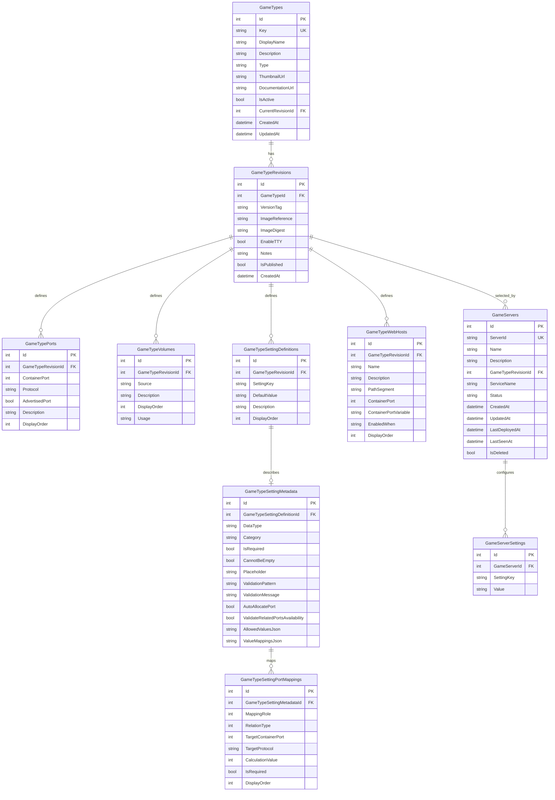
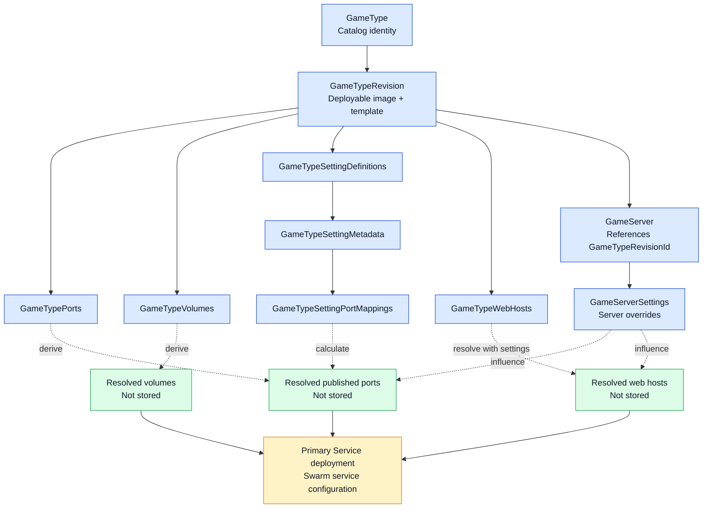

# GameServer.DB PostgreSQL Database Project

This project defines the V2 backend schema for PostgreSQL using `pgPacTool`.

All V2 PostgreSQL tables in this project are deployed into the `core` schema rather than `public`.

Project layout:

- `core/Tables/*.sql` defines all V2 tables and indexes in that schema

## Tooling

```powershell
dotnet tool restore
```

The project uses the `MSBuild.Sdk.PostgreSql` SDK package for project structure and build integration, and the local `pgpac` CLI for deployment operations.

## Compile

```powershell
dotnet build .\src\GameServer.DB.PostgreSql\GameServer.DB.PostgreSql.csproj -c Release
```

## Deploy

```powershell
.\scripts\Deploy-V2PostgresDatabase.ps1 -TargetConnectionString "Host=localhost;Database=gameserver-v2;Username=postgres;Password=postgres"
```

The application does not create the V2 PostgreSQL schema with EF migrations. Deploy this project first with `pgpac publish` before running the API against PostgreSQL. The application startup check expects V2 PostgreSQL tables such as `core."GameTypes"` to exist after deployment.

## Database Diagram

The diagram below is aligned with the current V2 entities in `src/GameServer.Docker/Data/V2/Entities.cs` and the SQL files in this project.



## Deployment Flow Diagram

This view focuses on how authored V2 data flows into deployment-time state.



Legend:
- Blue = persisted V2 tables
- Green = deployment-time derived state
- Amber = deployment output / orchestration target

### Notes

- `GameTypes` owns catalog identity; `GameTypeRevisions` owns deployable image details.
- `GameServers` references only `GameTypeRevisionId` and derives game type/image information through that revision.
- Port and volume instances are intentionally not stored per server in V2.
- Port mapping rows store a direct primary mapping plus optional related mapping rules using `CalculationValue`.
- Port mapping descriptions are shown from the linked `GameTypePorts.Description` and are not stored on the mapping rows.
- The more detailed reference copy of this diagram lives in `docs/reference/V2-Database-Diagram.md`.

